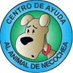

# CAAN - Centro de Adopción de Animales de Necochea



## 📋 Descripción

CAAN (Centro de Adopción de Animales de Necochea) es un sitio web diseñado para facilitar la adopción de animales rescatados, promover el voluntariado y recibir donaciones para el cuidado de mascotas en situación de calle. El proyecto busca crear un puente entre los animales que necesitan un hogar y las familias que desean adoptarlos.

## 🎯 Características Principales

- **Sistema de Adopciones**: Catálogo completo de animales disponibles para adopción con filtros por tipo, edad y características
- **Gestión de Denuncias**: Formulario confidencial para reportar casos de maltrato o abandono animal
- **Portal de Donaciones**: Sistema de donaciones único o recurrente con múltiples opciones de monto
- **Noticias y Actualizaciones**: Sección de noticias sobre rescates, eventos y actividades del centro
- **Información de Contacto**: Múltiples canales de comunicación con el centro
- **FAQ Interactivo**: Preguntas frecuentes organizadas por categorías
- **Diseño Responsivo**: Totalmente adaptado para dispositivos móviles, tablets y desktop

## 🛠️ Tecnologías Utilizadas

- **HTML5**: Estructura semántica del sitio
- **Tailwind CSS**: Framework CSS para el diseño responsivo
- **JavaScript**: Funcionalidades interactivas (menú móvil, navegación)
- **Google Fonts**: 
  - Be Vietnam Pro (cuerpo de texto)
  - Plus Jakarta Sans (encabezados)
- **Material Symbols**: Iconografía moderna y consistente

## 📁 Estructura del Proyecto

```
CAAN/
│
├── index.html              # Página principal
├── adopciones.html         # Catálogo de animales en adopción
├── sobre_nosotros.html     # Historia y presentación del centro
├── noticias.html           # Noticias y actualizaciones
├── faq.html                # Preguntas frecuentes
├── denuncias.html          # Formulario de denuncias
├── contacto.html           # Información de contacto
├── donaciones.html         # Portal de donaciones
├── CaanLogo.png           # Logo del centro
└── README.md              # Este archivo
```

## 🎨 Paleta de Colores

El diseño utiliza un sistema de colores basado en Material Design 3:

- **Primary**: `#0f5238` (Verde oscuro)
- **Primary Container**: `#2d6a4f`
- **Secondary**: `#895100` (Naranja/Dorado)
- **Secondary Container**: `#fd9d1a`
- **Tertiary**: `#713638` (Rojo oscuro)
- **Error**: `#ba1a1a`
- **Background**: `#f8faf6`
- **Surface**: `#f8faf6`

## 🚀 Instalación y Uso

### Requisitos Previos

- Navegador web moderno (Chrome, Firefox, Safari, Edge)
- Conexión a internet (para cargar Tailwind CSS y fuentes)

### Instalación

1. Clona o descarga el repositorio:
```bash
git clone https://github.com/tu-usuario/caan.git
```

2. Navega al directorio del proyecto:
```bash
cd caan
```

3. Abre `index.html` en tu navegador preferido:
```bash
# En Linux/Mac
open index.html

# En Windows
start index.html
```

### Despliegue

El sitio es completamente estático y puede desplegarse en cualquier servicio de hosting:

- **GitHub Pages**
- **Netlify**
- **Vercel**
- **Firebase Hosting**
- Cualquier servidor web tradicional

## 📱 Características Responsivas

El sitio está optimizado para:

- 📱 **Móviles**: 320px - 767px
- 📱 **Tablets**: 768px - 1023px
- 💻 **Desktop**: 1024px en adelante

### Breakpoints de Tailwind

```css
sm: 640px   /* Smartphones en landscape */
md: 768px   /* Tablets */
lg: 1024px  /* Desktop pequeño */
xl: 1280px  /* Desktop grande */
```

## 🧩 Componentes Principales

### Navegación
- Menú de escritorio con enlaces principales
- Menú móvil tipo hamburguesa
- Botón CTA de "Donar" siempre visible
- Logo clickeable que retorna al inicio

### Tarjetas de Animales
- Imagen principal con botón de navegación
- Información básica (nombre, raza, edad)
- Etiquetas de categoría (Cachorro, Adulto, Senior)
- Botón de acción para conocer más

### Formularios
- Campos de entrada con validación visual
- Selectores personalizados
- Textareas redimensionables
- Botones de envío con feedback visual

## 🔧 Personalización

### Modificar Colores

Los colores se definen en la configuración de Tailwind dentro de cada archivo HTML:

```javascript
tailwind.config = {
  theme: {
    extend: {
      colors: {
        // Modifica aquí los colores
        primary: "#0f5238",
        // ...
      }
    }
  }
}
```

### Modificar Tipografía

Las fuentes se importan desde Google Fonts. Para cambiarlas, actualiza los enlaces en el `<head>`:

```html
<link href="https://fonts.googleapis.com/css2?family=Tu+Fuente&display=swap" rel="stylesheet" />
```

## 📊 Secciones del Sitio

### 1. **Inicio** (`index.html`)
- Hero section con call-to-action
- Tarjetas de acciones rápidas (Denuncias, Voluntariado, Noticias)
- Galería de animales destacados
- Banner de donación

### 2. **Adopciones** (`adopciones.html`)
- Sistema de filtros (Todos, Perros, Gatos, Casos Especiales)
- Buscador de animales
- Grid responsivo de tarjetas
- Paginación

### 3. **Sobre Nosotros** (`sobre_nosotros.html`)
- Historia del centro
- Galería de fotos del predio
- Información sobre instalaciones
- Misión y visión

### 4. **Noticias** (`noticias.html`)
- Grid de noticias recientes
- Categorías (Rescate, Instalaciones, Comunidad)
- Búsqueda y filtros
- Paginación

### 5. **FAQ** (`faq.html`)
- Navegación lateral por categorías
- Acordeones expandibles
- Tarjeta de contacto
- Información sobre adopción y voluntariado

### 6. **Denuncias** (`denuncias.html`)
- Formulario confidencial
- Opciones de anonimato
- Carga de evidencia (fotos/videos)
- Mensajes de seguridad y privacidad

### 7. **Contacto** (`contacto.html`)
- Formulario de contacto
- Información de ubicación
- Horarios de atención
- Mapa integrado
- Links a redes sociales

### 8. **Donaciones** (`donaciones.html`)
- Opciones de donación única o mensual
- Selector de montos predefinidos
- Entrada personalizada de monto
- Indicador de progreso de meta
- Lista de insumos necesarios

## 🤝 Contribución

Si deseas contribuir al proyecto:

1. Fork el repositorio
2. Crea una rama para tu feature (`git checkout -b feature/NuevaCaracteristica`)
3. Commit tus cambios (`git commit -m 'Agrega nueva característica'`)
4. Push a la rama (`git push origin feature/NuevaCaracteristica`)
5. Abre un Pull Request

## 📞 Información de Contacto

**CAAN - Centro de Adopción de Animales de Necochea**

- 📍 **Residencia**: Calle 521-3554, Quequén, Pcia. Buenos Aires
- 📍 **Predio**: Calle 107 y 66, Necochea, Pcia. Buenos Aires
- 📧 **Email**: caan_necochea@gmail.com
- 📱 **Instagram**: [@caanecochea](https://www.instagram.com/caanecochea/)
- 📘 **Facebook**: [CAAN Necochea](https://www.facebook.com/groups/291987354785530)

## 📄 Licencia

© 2026 CAAN. Todos los derechos reservados.

## 🐾 Estado del Proyecto

**Versión**: prototipo  
**Estado**: Activo y en mantenimiento  
**Última actualización**: 2024

---

**Hecho con ❤️ para los animales de Necochea**
